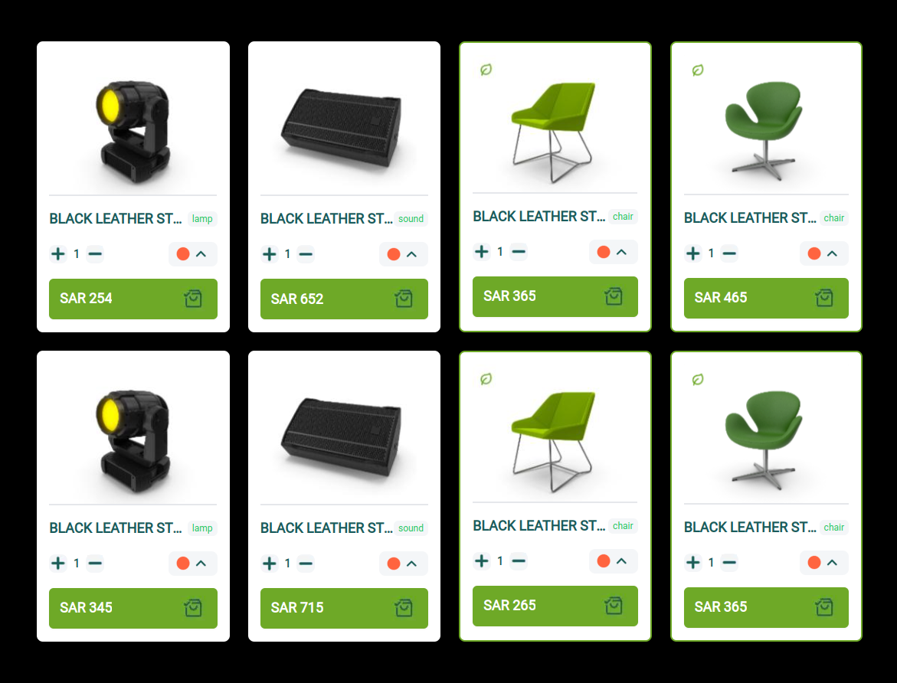

#### To run you need to install dependencies
`npm install`
#### Run script
`npm run start`

  1. The application was created in the `Next.js` environment;
  2. `Tailwind CSS` has used to style the components;
  3. Each card has its own counter, which is changed by clicking on the + and - buttons, as specified in the task, only the state for each element is changed (you can't lower it below 0). It would be possible to make a mutation for sending a request to the BE, for this you would need to add an additional field in the scheme on the simulated BE and write the request itself. It would also be possible to get the quantity from the BE. In this case, it would be possible to make a stored value when reloading the page, but it would be saved until the locally deployed BE would not be disabled;
  4. To emulate the work with the BE I chose the library `json-graphql-server` in which I put the scheme necessary for the task, and entered mock data. I executed queries to this BE using the `useQuery` from `Apollo Client`. And for simultaneous launching of both client and server I was helped by `concurrently` librarywith the help of which I wrote a script that launches client and server simultaneously;
  5. For the layout were taken pictures and icons from the sent screenshot, so the quality of pictures can be bad. But I tried to make the design as similar as possible:
    - The select button is displayed as a picture, as there is no logic for it. So I changed the cursor to inactive when hovering;
    - The green border around the card is displayed depending on the product category;
    - The placement of the components changes depending on the screen width (adaptive site);
    - When loading products from the BE, we are shown the loading screen with a characteristic cursor.

